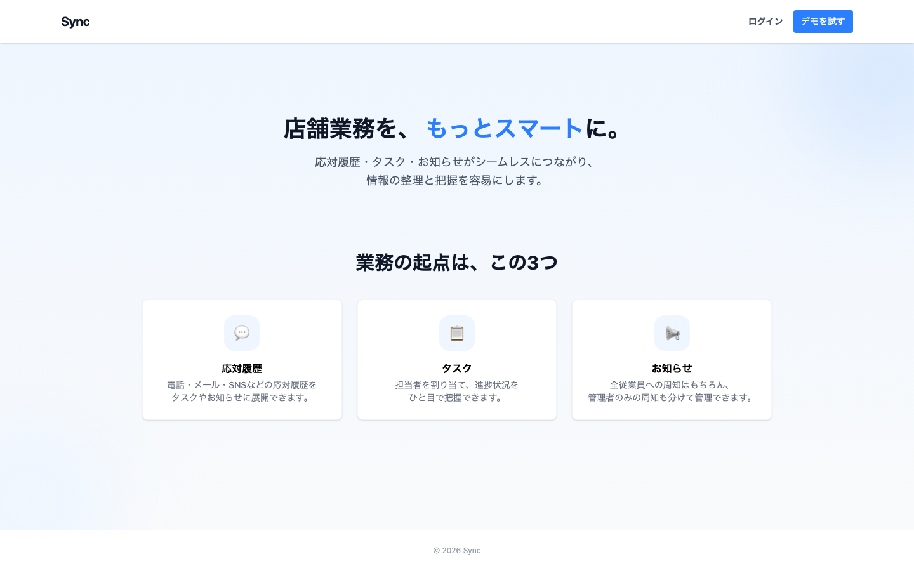
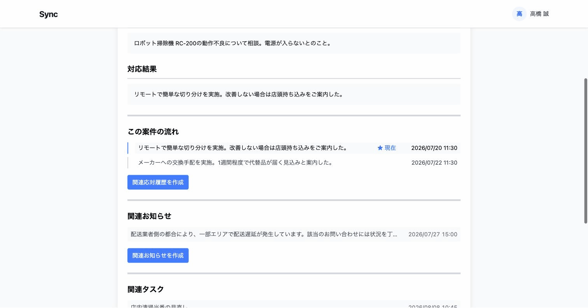
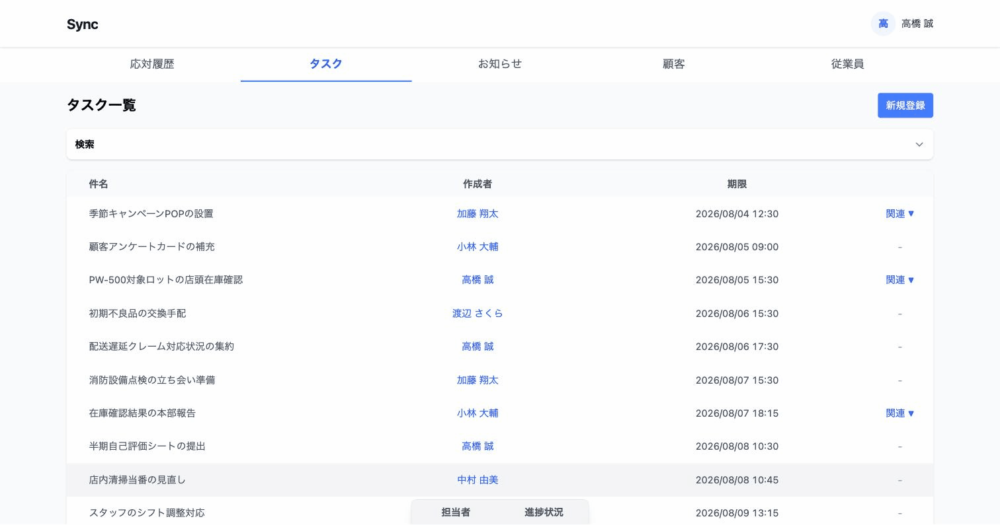
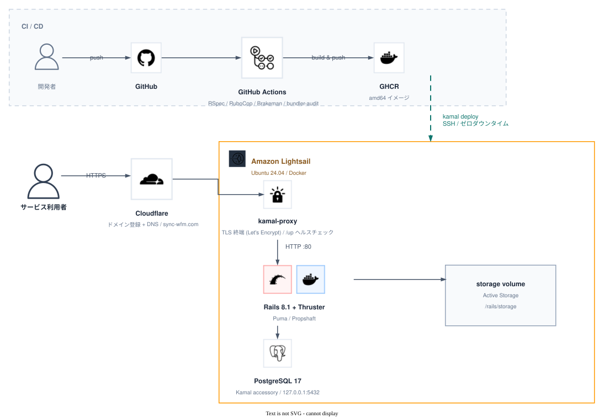
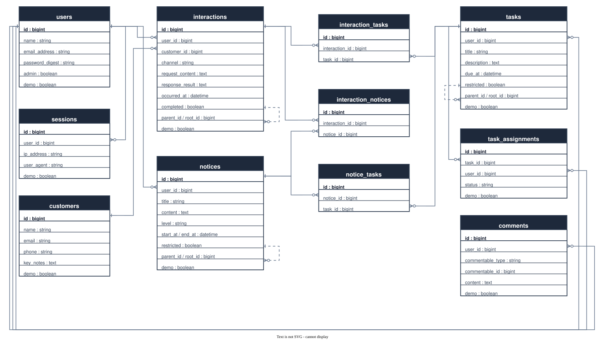

# Sync

顧客対応から生まれる業務を一元管理するアプリ。
応対履歴・タスク・お知らせ・顧客・従業員の情報を、相互に関連付けたまま管理する。

**デモ環境: https://sync-wfm.com**
トップページの「デモを試す」ボタンから、登録なしでログインできる。



---

## なぜ作ったか

以前、情報のほとんどが紙とその場のやりとりだけで回っている現場で
働いていたことがある。伝えたいことがあれば人を探して伝えるか、
メモを書き置きするしかなく、確認したいことは紙の記録をめくって
探すか、直接聞くしかなかった。

また、電話だけで完結したやり取りの記録が残らず、同じ顧客から
再び連絡が来てもいつ・誰が・どんな理由で対応したのか誰も分からない、
という経験もした。対応者も困るし、顧客にも「前にも話したのに」と
苛立たれる。

情報が一箇所にまとまっていないだけで、仕事はここまで非効率になる。
紙・口頭・その場限りのやりとりでは、情報は「点」のまま散らばり、
他の情報とのつながりが見えない。応対履歴・タスク・お知らせ・顧客・
従業員を相互にリンクさせ、点在する情報を「網の目」のようにつなぎ、
ひとつの情報から関連する情報をシームレスに辿れる状態を目指したのが、
このアプリの出発点。

## 主な機能

- **相互リンクによる追跡性** — 応対履歴・タスク・お知らせ・顧客・従業員が互いにリンクされ、
  ひとつのレコードから関連する情報を辿れる。同じテーブル内でも、関連レコード同士の
  関係性が一覧で把握できる
- **タスクの進捗管理** — 担当者ごとの進捗状況を管理できる
- **権限制御** — タスク・お知らせは、公開範囲を「管理者のみ」に絞れる
- **コメント** — 応対履歴・タスク・お知らせのどれにでも紐づけられる

応対履歴詳細画面から、関連するタスク・お知らせ・自己参照による関連グループ
（この案件の流れ）を相互に行き来できる。



タスク一覧では行にカーソルを合わせるだけで担当者ごとの進捗状況を確認でき、
詳細画面では一覧表示で確認できる。



---

## 技術構成

| 領域 | 採用技術 |
| --- | --- |
| 言語 / フレームワーク | Ruby 4.0 / Rails 8.1 |
| データベース | PostgreSQL 17 |
| フロントエンド | Hotwire (Turbo / Stimulus)、Import Maps、Tailwind CSS 4 |
| ファイル保存 | Active Storage + ruby-vips |
| テスト | RSpec、FactoryBot、Capybara |
| 静的解析 | RuboCop (rails-omakase)、Brakeman、bundler-audit |
| CI / CD | GitHub Actions |
| コンテナ / デプロイ | Docker、Kamal 2 |
| インフラ | Amazon Lightsail、Cloudflare（ドメイン登録・DNS） |

フロントエンドは Hotwire（Turbo / Stimulus）を選んだ。React や Next.js は学習していない
状態だったため、フロントエンドの学習コストを増やすより、Rails の標準の枠内でどこまで
動的なUIを再現できるかを検証する方を選んだ。

インフラの選定理由は後述の「アーキテクチャ」を参照。

---

## アーキテクチャ

### インフラ



AWS の理解がまだ浅い状態だったので、まずは Lightsail 1台 + Docker の最小構成にしている。
段階的に本格的な構成へ移行予定（「今後の課題」参照）。構築手順は [docs/DEPLOYMENT.md](docs/DEPLOYMENT.md)。

図のソースは [docs/diagrams/infrastructure.drawio](docs/diagrams/infrastructure.drawio) にあり、[draw.io](https://app.diagrams.net) で開いて編集できる。

## ER図



`comments` はどのテーブルにも紐づけられるよう `commentable_type` によるポリモーフィック
関連にしている。

全カラム・全テーブル（Active Storage 含む）は [docs/diagrams/schema.dbml](docs/diagrams/schema.dbml) を参照。
図のソース（draw.io 形式）は [docs/diagrams/schema.drawio](docs/diagrams/schema.drawio)。

---

## ローカル環境の構築

### 必要なもの

- Ruby 4.0.1（`.ruby-version` 参照）
- PostgreSQL 17
- libvips（画像処理）

```bash
# macOS の場合
brew install postgresql@17 vips
```

### セットアップ

```bash
git clone https://github.com/minamoto64/wfm-single.git
cd wfm-single

bundle install
bin/rails db:prepare
bin/rails db:seed        # 通常データ
bin/rails demo:reset     # デモデータ

bin/dev                  # http://localhost:3000
```

初期ユーザーのパスワードは開発環境では `password`。
本番では `SEED_ADMIN_PASSWORD` などの環境変数が必須になる（`db/seeds.rb` 参照）。

### テストと静的解析

```bash
bundle exec rspec        # 48 ファイルのテスト
bin/rubocop              # スタイル
bin/brakeman --no-pager  # セキュリティ静的解析
bin/bundler-audit        # 依存 gem の脆弱性
```

---

## 設計上の工夫

### 可視範囲を concern に切り出す

「誰がどのレコードを見られるか」の判定は、コントローラに散らばると抜け漏れが
起きやすい。以下の3つの concern に責務を分けている。

- `DemoScoped` — デモデータと通常データの隔離
- `Restrictable` — レコードごとに公開範囲を「管理者のみ」に絞る
- `Rootable` — 自己参照の親子関係における root の解決

これらを合成した `readable` スコープを各モデルに持たせ、コントローラは
`Model.readable` から引くだけにしている。権限まわりのリクエストスペック
（`restricted_visibility_spec.rb` 等）で境界が守られていることを検証している。

### 画像を認可経由で配信する

Active Storage の署名付き URL は、URL を知っていれば誰でも取得できてしまう。
「管理者のみ」のレコードに添付された画像がそれでは漏れるため、
`AttachmentsController` を挟んで、レコードを閲覧できるかどうかの判定を通過した場合のみ
配信するようにしている。

### フォームオブジェクト

タスクの登録は「タスク本体 + 担当者の割り当て + 関連レコードの紐付け」を
1つの画面で扱うため、`TaskForm` にまとめてコントローラを薄く保っている。

### デモモードの設計

ポートフォリオとして誰でも触れる状態にする一方で、見学者の操作が本来のデータを
壊さないようにする必要があった。

そこで全モデルに `demo` フラグを持たせ、`DemoScoped` concern で「デモユーザーは
デモデータだけ、通常ユーザーは通常データだけ」を見るようにデフォルトの可視範囲を
切り替えている。`bin/rails demo:reset` でデモデータだけを削除・再投入できるため、
定期的に初期状態へ戻せる。

この分離が実際に効いているかは `spec/requests/demo_isolation_spec.rb` で検証している。

---

## 今後の課題

- Lightsail 1台構成から、AWS の理解を深めた上での本格的な構成（VPC / ECS など）へ移行する
- インフラを Terraform で定義する
- デモデータの定期リセットを Solid Queue の recurring job で自動化する
- Active Storage の保存先を S3 に移し、ディスク使用量をインスタンスから切り離す
- N+1 の継続監視（開発環境では Bullet を導入済み）
- 応対履歴・タスク・お知らせの内容入力欄に要約ボタンを設置し、登録作業の時間を短縮する。
  入力の手間を減らせなければ、結局手書きのメモに戻ってしまう。
  要約ボタンでその差を埋めたい（API連携の学習・実装が必要で未着手）
