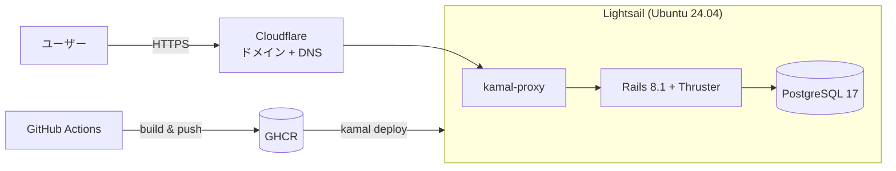
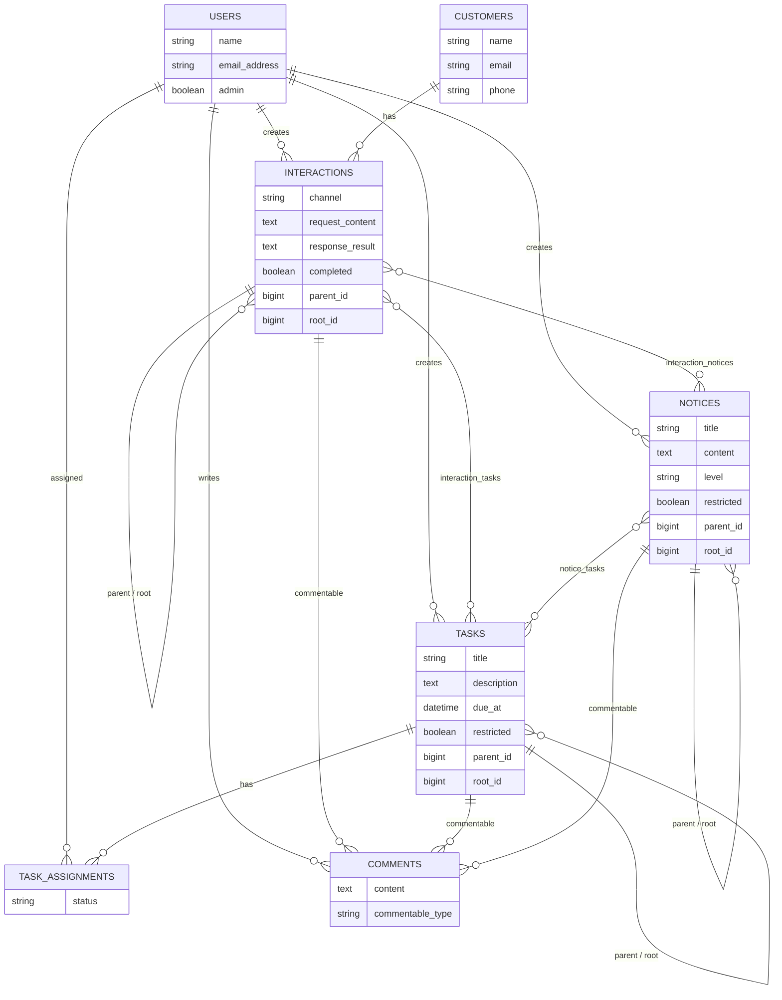

# wfm-single

店舗・小規模チーム向けの業務情報集約アプリ。
顧客応対・タスク・全体周知という 3 種類の業務イベントを、相互に関連付けたまま管理する。

**デモ環境: https://sync-wfm.com**
トップページの「デモを試す」ボタンから、登録なしでログインできる。

---

## 何を解決するアプリか

現場の情報は「顧客から電話が来た」「その対応で誰かに作業を頼んだ」「全員に周知した」という
つながりを持っているのに、実際には応対メモ・タスク管理ツール・掲示板がそれぞれ分断されている。
結果として「この作業依頼は何が発端だったのか」が後から辿れなくなる。

このアプリは 3 つの業務イベントをテーブルとして分離しつつ、
中間テーブルで相互に接続することで、**発端から結果までの流れを双方向に辿れる**ようにしている。

```
応対履歴 (Interaction) ──┬── タスク (Task)
                          │        │
                          └── お知らせ (Notice)
```

例えば「商品Xの不具合報告」という応対履歴から、そこで発行された「再発防止策の検討」タスクと
「クレーム多発の注意喚起」お知らせの両方へ辿れる。逆にタスク側からも発端の応対履歴が見える。

さらに応対履歴・タスク・お知らせはそれぞれ**自己参照の親子関係**を持てるため、
「一次対応 → 二次対応」のような時系列の連なりも表現できる。

---

## 主な機能

- **応対履歴 / タスク / お知らせ の CRUD** と、相互の関連付け
- **顧客管理**と、顧客を軸にした応対履歴の集約
- **認証**（Rails 8 標準の認証ジェネレータ + `has_secure_password`）とパスワードリセット
- **権限制御** — 一般ユーザー / 管理者、レコード単位の「関係者限定」「管理者限定」
- **検索・絞り込み**（Ransack）と**ページネーション**（Pagy）
- **画像添付**（Active Storage + ruby-vips によるサムネイル生成）と、認可を通した配信
- **コメント**によるレコード単位の議論
- **デモモード** — `demo: true` のレコードだけが見える隔離された体験用データセット

### デモモードの設計

ポートフォリオとして誰でも触れる状態にする一方で、見学者の操作が
本来のデータを壊さないようにする必要があった。

そこで全モデルに `demo` フラグを持たせ、`DemoScoped` concern で
「デモユーザーはデモデータだけ、通常ユーザーは通常データだけ」を見るように
デフォルトの可視範囲を切り替えている。`bin/rails demo:reset` で
デモデータだけを削除・再投入できるため、定期的に初期状態へ戻せる。

この分離が実際に効いているかは `spec/requests/demo_isolation_spec.rb` で検証している。

---

## 技術構成

| 領域 | 採用技術 |
| --- | --- |
| 言語 / フレームワーク | Ruby 4.0 / Rails 8.1 |
| データベース | PostgreSQL 17 |
| フロントエンド | Hotwire (Turbo / Stimulus)、Import Maps、Tailwind CSS 4 |
| アセット | Propshaft |
| 非同期処理 / キャッシュ | Solid Queue / Solid Cache / Solid Cable |
| ファイル保存 | Active Storage + ruby-vips |
| テスト | RSpec、FactoryBot、Capybara |
| 静的解析 | RuboCop (rails-omakase)、Brakeman、bundler-audit |
| CI / CD | GitHub Actions |
| コンテナ / デプロイ | Docker、Kamal 2 |
| インフラ | Amazon Lightsail、Cloudflare（ドメイン登録・DNS） |

---

## インフラ構成



`main` への push で CI が成功すると、GitHub Actions が amd64 イメージをビルドして GHCR に push し、
Kamal がゼロダウンタイムでコンテナを差し替える。構築手順の全文は [docs/DEPLOYMENT.md](docs/DEPLOYMENT.md)。

---

## DB構造



`interaction_tasks` / `interaction_notices` / `notice_tasks` は中間テーブルで、
3つの業務イベントを相互に関連付けている。`comments` は `commentable_type` による
ポリモーフィック関連で、3つのイベントどれにでも紐付く。

---

## ローカル環境の構築

### 必要なもの

- Ruby 4.0.1（`.ruby-version` 参照）
- PostgreSQL 17
- libvips（画像処理）

```bash
# macOS の場合
brew install postgresql@17 vips
```

### セットアップ

```bash
git clone https://github.com/minamoto64/wfm-single.git
cd wfm-single

bundle install
bin/rails db:prepare
bin/rails db:seed        # 通常データ
bin/rails demo:reset     # デモデータ

bin/dev                  # http://localhost:3000
```

初期ユーザーのパスワードは開発環境では `password`。
本番では `SEED_ADMIN_PASSWORD` などの環境変数が必須になる（`db/seeds.rb` 参照）。

### テストと静的解析

```bash
bundle exec rspec        # 48 ファイルのテスト
bin/rubocop              # スタイル
bin/brakeman --no-pager  # セキュリティ静的解析
bin/bundler-audit        # 依存 gem の脆弱性
```

---

## 設計上の工夫

### 可視範囲を concern に切り出す

「誰がどのレコードを見られるか」の判定は、コントローラに散らばると
抜け漏れが起きやすい。以下の 3 つの concern に責務を分けている。

- `DemoScoped` — デモデータと通常データの隔離
- `Restrictable` — 「関係者限定」「管理者限定」の可視性
- `Rootable` — 自己参照の親子関係における root の解決

これらを合成した `readable` スコープを各モデルに持たせ、
コントローラは `Model.readable` から引くだけにしている。
権限まわりのリクエストスペック（`restricted_visibility_spec.rb` 等）で
境界が守られていることを検証している。

### 画像を認可経由で配信する

Active Storage の署名付き URL は、URL を知っていれば誰でも取得できてしまう。
「関係者限定」のレコードに添付された画像がそれでは漏れるため、
`AttachmentsController` を挟んで、レコードの可視性判定を通過した場合のみ
配信するようにしている。

### フォームオブジェクト

タスクの登録は「タスク本体 + 担当者の割り当て + 関連レコードの紐付け」を
1 つの画面で扱うため、`TaskForm` にまとめてコントローラを薄く保っている。

---

## 今後の課題

- デモデータの定期リセットを Solid Queue の recurring job で自動化する
- Active Storage の保存先を S3 に移し、ディスク使用量をインスタンスから切り離す
- インフラを Terraform で定義する
- N+1 の継続監視（開発環境では Bullet を導入済み）
